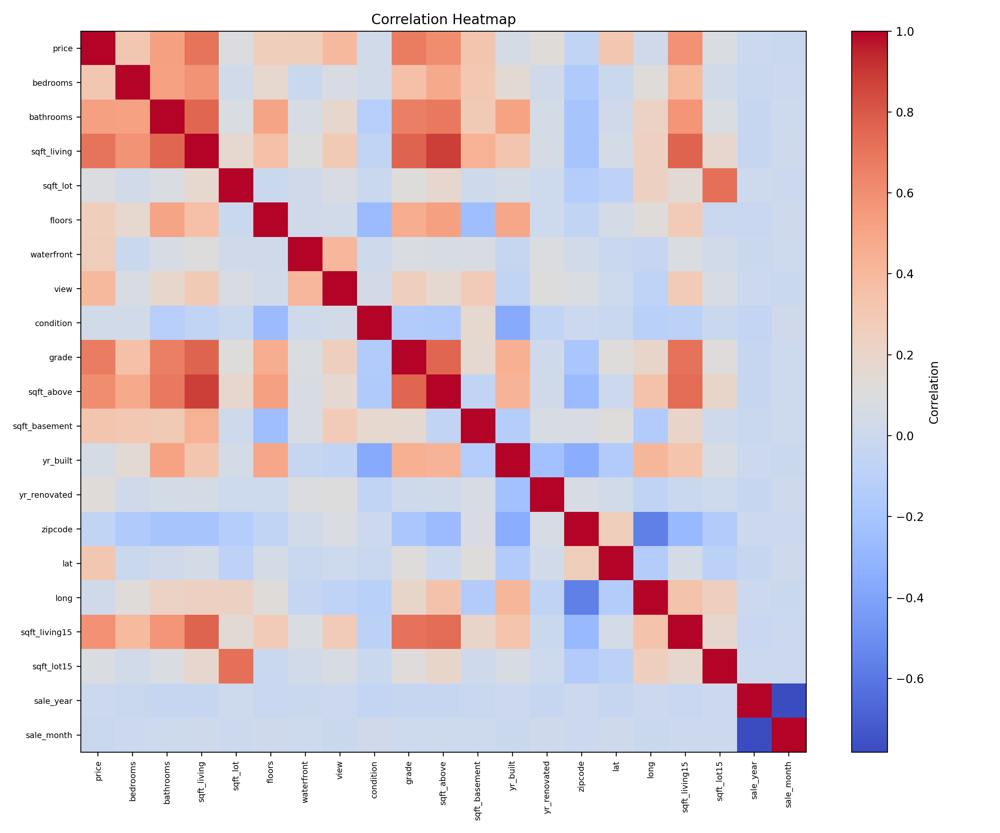
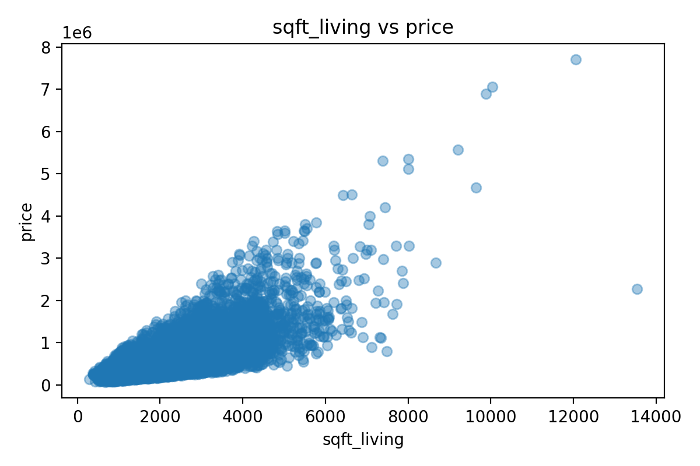
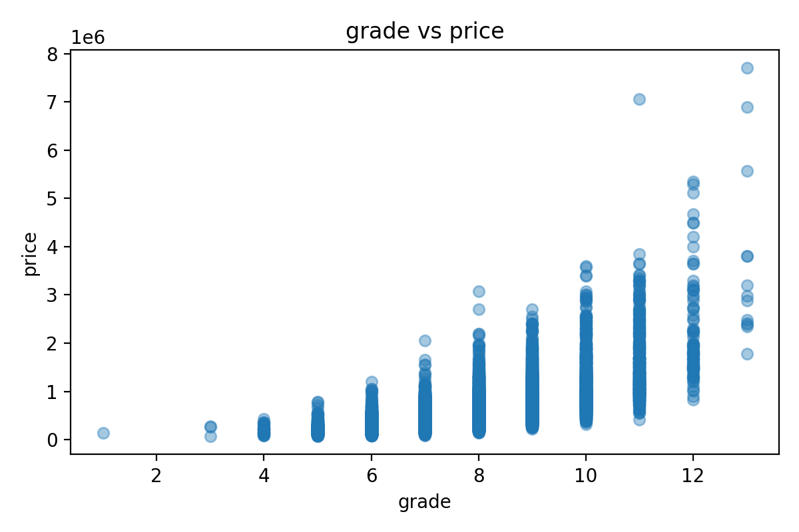
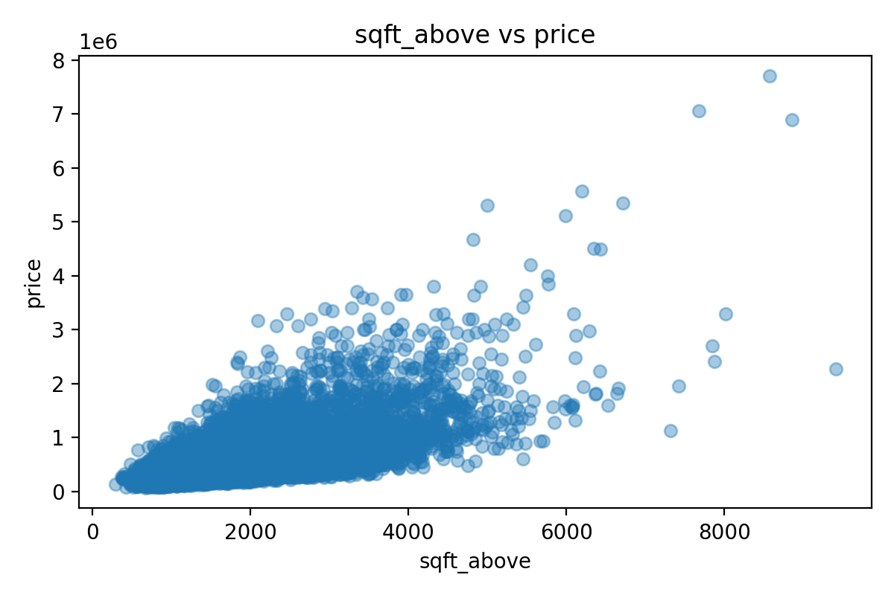

# Assignment 3 - Linear Regression

## Dataset Description
This assignment uses a housing dataset with `21,613` rows and `21` columns.

The target variable is:
- `price`

Examples of input features used in the model:
- `bedrooms`
- `bathrooms`
- `sqft_living`
- `sqft_lot`
- `floors`
- `grade`
- `sqft_above`
- `sqft_basement`
- `yr_built`
- `zipcode`
- `lat`
- `long`
- `sqft_living15`
- `sqft_lot15`

The `date` column was converted into `sale_year` and `sale_month`, and the `id` column was dropped because it is not useful for prediction.

## Files Included
- `dataset.csv`
- `linear_regression.py`
- `eda.py`
- `main.py`
- `README.md`

## Steps Performed

### 1. Data Understanding
- Loaded the housing dataset
- Identified `price` as the target variable
- Used the remaining columns as input features

### 2. Data Cleaning
- Removed duplicate rows
- Handled missing values using median for numerical columns and mode for categorical columns
- Converted `date` into proper datetime format
- Created `sale_year` and `sale_month`
- Dropped the `id` column
- Used simple encoding with `pd.get_dummies()` if categorical columns were present
- Applied standard scaling before model training

### 3. Exploratory Data Analysis
Performed EDA in `eda.py`:
- Correlation heatmap
- Scatter plots between top important features and target
- Checked multicollinearity using high-correlation feature pairs

Generated plot files:
- `correlation_heatmap.png`
- scatter plot images for the top 3 correlated features

### EDA Visuals
**Correlation Heatmap**



**Scatter Plot: sqft_living vs price**



**Scatter Plot: grade vs price**



**Scatter Plot: sqft_above vs price**



### 4. Data Split
- Training data: `80%`
- Testing data: `20%`

### 5. Model Building
- Used `LinearRegression` from `sklearn`
- Trained the model on training data
- Predicted house prices on testing data

### 6. Model Evaluation
Metrics used:
- Mean Squared Error (MSE)
- R^2 Score

Interpretation:
- Lower MSE means better prediction error
- R^2 closer to `1` means a better fit

## Results
- **MSE:** `44,959,306,834.92`
- **R^2 Score:** `0.7026`
- Top features most related to price in EDA: `sqft_living`, `grade`, `sqft_above`
- High multicollinearity pairs found: `6`

## Interpretation
- Features with positive coefficients increase house price
- Features with negative coefficients decrease house price
- Main positive features in this model:
  - `grade`
  - `lat`
  - `sqft_living`
  - `sqft_above`
  - `waterfront`
- Main negative features in this model:
  - `yr_built`
  - `bedrooms`
  - `zipcode`
  - `long`
  - `sqft_lot15`

This means better house quality, larger living area, and waterfront presence increase price, while some location-related or older-property factors reduce the predicted price in this model.

## How to Run
```bash
python main.py
```

## Conclusion
This assignment demonstrates a simple linear regression workflow from data cleaning to model evaluation. The model achieved an `R^2` score of `0.7026`, which means the model explains around `70%` of the variation in house prices. The `MSE` value shows that some prediction error still exists, but the model gives a reasonable fit for a basic linear regression approach. The coefficient values help explain how the main features affect house price in positive and negative directions.
