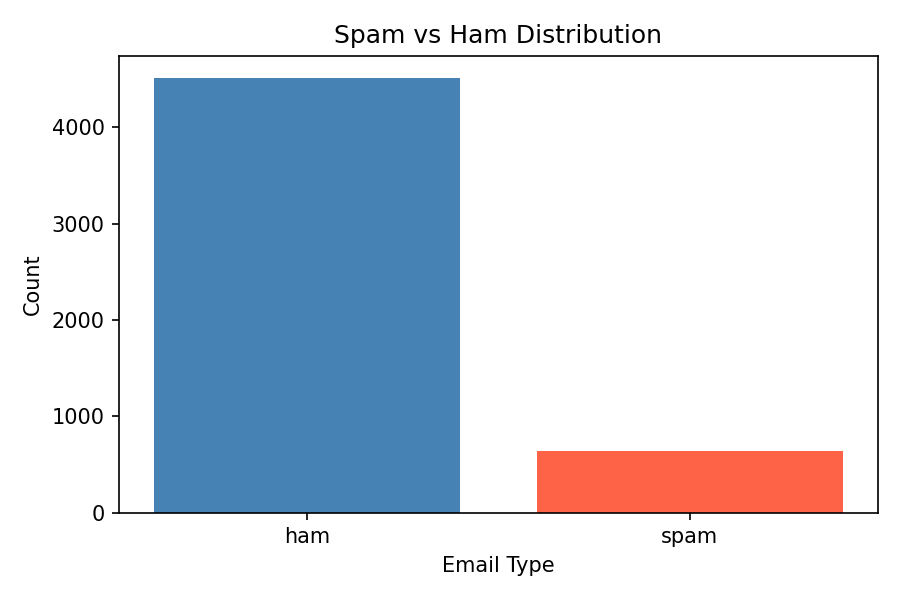
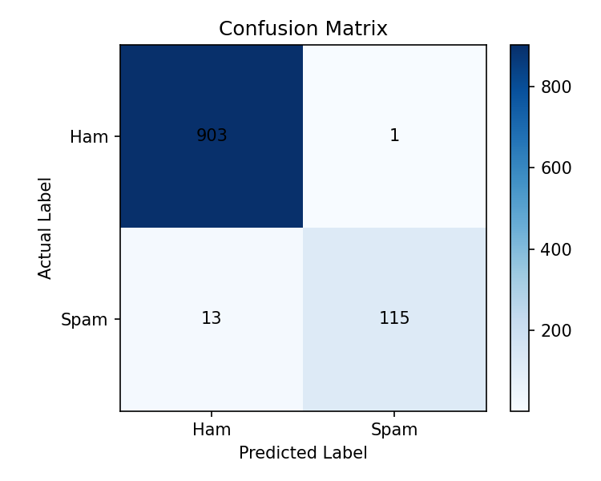

# Assignment 4: Spam Email Detection using SVM

## Dataset Description
This assignment uses the **Spam Email Detection** dataset provided in Excel format: `Spam Email Detection.xlsx`.

- Total original rows: 5572
- Rows after cleaning and duplicate removal: 5158
- Main columns:
  - `v1`: label (`ham` or `spam`)
  - `v2`: email/message text
- Extra unnamed columns were empty and removed during cleaning

This is a text classification problem where the goal is to predict whether a message is **spam** or **ham**.

## Steps Performed
1. Loaded the dataset from the Excel file.
2. Kept only the useful columns (`label` and `message`).
3. Removed empty values and duplicate rows.
4. Converted the target labels:
   - `ham` -> 0
   - `spam` -> 1
5. Converted text into numerical features using **TF-IDF Vectorization**.
6. Split the dataset into:
   - 80% training data
   - 20% testing data
7. Trained an **SVM model** using `LinearSVC`.
8. Evaluated the model using:
   - Accuracy
   - Precision
   - Recall
   - F1 Score
9. Saved the cleaned data, predictions, results summary, and plots.

## Why SVM?
SVM works well for text classification problems because it can separate classes effectively in high-dimensional feature space. After TF-IDF vectorization, the messages become sparse numeric vectors, and Linear SVM is a simple and strong model for this type of data.

## Files in This Assignment
- `Spam Email Detection.xlsx` -> original dataset
- `svm_model.py` -> data cleaning, model training, evaluation, and output saving functions
- `main.py` -> runs the complete assignment
- `spam_cleaned.csv` -> cleaned dataset used for training
- `spam_predictions.csv` -> predictions on test data
- `results_summary.txt` -> saved evaluation results
- `class_distribution.png` -> class count plot
- `confusion_matrix.png` -> confusion matrix plot

## How to Run
```bash
python main.py
```

## Results
- Accuracy: `0.9864`
- Precision: `0.9914`
- Recall: `0.8984`
- F1 Score: `0.9426`
- Test set size: `1032`
- Confusion Matrix:

```text
[[903   1]
 [ 13 115]]
```

## Interpretation
- The model performs very well on this dataset.
- High accuracy shows that most messages were classified correctly.
- High precision means when the model predicts spam, it is usually correct.
- Good recall means the model successfully catches most spam messages.
- F1 score shows a strong balance between precision and recall.

In this assignment, the model is able to distinguish spam and ham messages effectively using only the message text.

## Output Files
- `spam_cleaned.csv`
- `spam_predictions.csv`
- `results_summary.txt`
- `class_distribution.png`
- `confusion_matrix.png`

## Visual Outputs
### Class Distribution


### Confusion Matrix


## Conclusion
This assignment successfully performs spam email detection using an SVM model. The dataset was cleaned, converted into TF-IDF features, and used to train a Linear SVM classifier. The final model achieved strong accuracy and classification performance, showing that SVM is a suitable method for spam detection on this dataset.
